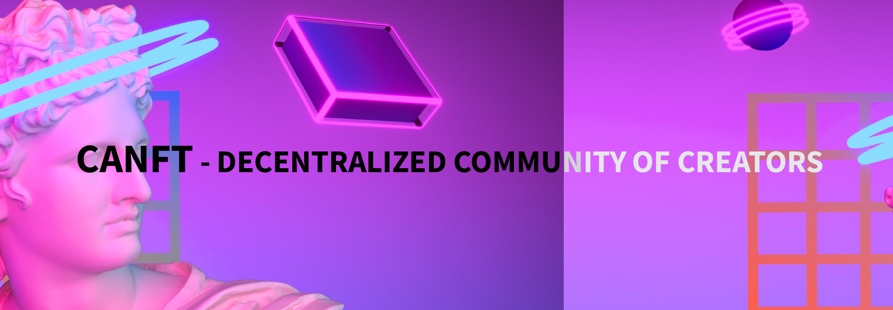
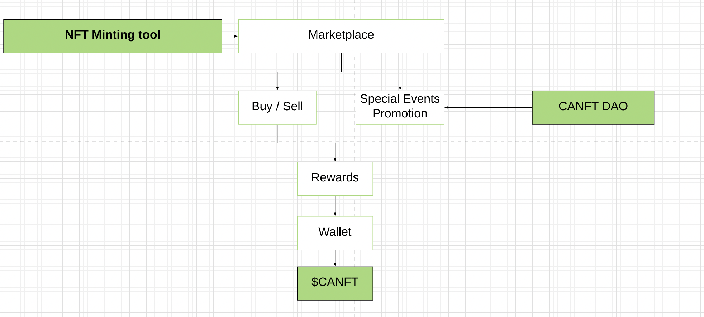

# 🎨 CANFT 🎨

  

Canft is an NFT market built on the PoS-based blockchain, [Casper Network](https://casper-network.com/). But it is not only a market for NFTs if not a decentralized market.

On the platform, you can create your NFTs on the Casper blockchain network, sell your NFTs, buy them or place them at auction. Apart from this, you can also propose themes to promote with special collectibles, for example, Halloween, Christmas, kittens, zombies, Casper, Gaming, etc ... every certain season.

You cannot allow a greater breadth for the creations of the artists and a greater interaction for these types of communities, the idea is not only to sell the NFTs but also that the artists can actually exhibit their works and interact with other artists.

## Why Casper Network?

The Casper Network is the first live proof-of-stake blockchain built off the Casper CBC specification. Casper is designed to accelerate enterprise and developer adoption of blockchain technology today and evolve to meet user needs in the future.

> Casper also solves the scalability trilemma. Notably, the network is optimized for security, decentralization, and high throughput. 
All this is achieved while evolving to provide leading solutions for open-source projects and enterprises.

This certainly means that thanks to Casper, canft users will pay a lower fee for their interactions and get the benefit of a fast network. (Who wants to spend several minutes on purchase these days?). 

But it's not just about low fees and high speed, it's about security as well. In the end, the nfts will be assets and as all assets must be protected, that is why Casper is ideal, since thanks to its architecture that breaks [the blockchain trilemma](https://coinmarketcap.com/alexandria/glossary/blockchain-trilemma), we can say with certainty that Casper is safe.

## CANFT DAO

Canft will allow artists and stakeholders to participate in decisions at the project level so that they work not only now but in the long term.

Among the options they can choose will be:

- ✔️ Protocol
- ✔️ Monthly content promotion (eg; Which artists or NFTs will be promoted in the month of October with the theme of Halloween)
- ✔️ Commissions (eg Royalties)
- ✔️ User Bann
- ✔️ Design updates
- ✔️ Selection of ambassadors
- Others

The weight of the rulers will be carried out by the governance token $ CANFT. And in each vote, they will not only participate in the DAO but they will also be rewarded for doing so, this as an incentive to continue participating in the decentralized network for artists; Canft.

The DAO will also cover the development of the project, that is, the cost to the development team, designers, community managers, and anyone responsible for making the project develop.

Initially, they will be informal voting carried out in a forum or a means designed for it. Then it will be through a platform where the weight of the vote will be counted as the amount of token owned by each interested party.
But the long-term goal is for the votes to be carried out 100% on-chain so that little by little it becomes an autonomous DAO without the intervention of any intermediary.

## 🚀 Roadmap 🚀

> Unfortunately, in the hackathon carried out in gitcoin, it was not possible to carry out a complete development (programming) of the project due to a lack of resources.

> If somehow it is possible to obtain some resources from the hackathon, or from a mini-grant awarded, the project team will be able to follow its development and secure the roadmap below.

### Q3 2021

#### 1 Canft Project Structure

- [ ] Build a landing page (React || VueJs && Typescript)
- [ ] Start developing the smart contracts (Rust)
- [ ] UI/UX Design
- [ ] Start developing the frontend for users to use the marketplace
- [ ] Launch token minter tool
- [ ] Allow for initial auction price and auctions, royalties, instant buy trigger, unlocked when purchased capabilities, special nft events, and mint off NFTs platform functionality.

#### 2 Canft Prototype

- [ ] Update website with full information about the project
- [ ] Prepare documentation
- [ ] Finish developing the marketplace smart contract
- [ ] Inject [casper-js-sdk](https://github.com/casper-ecosystem/casper-js-sdk)
- [ ] Start auditing (open-source audit tool)
- [ ] Finish frontend development
- [ ] Begin governance and token development

#### 3 Launch Canft V1

- [ ] Token issuance and airdrop
- [ ] Launch marketplace
- [ ] Kick-off marketing events
- [ ] Launch first version of DAO Governance
- [ ] Audit

## How it Works?

